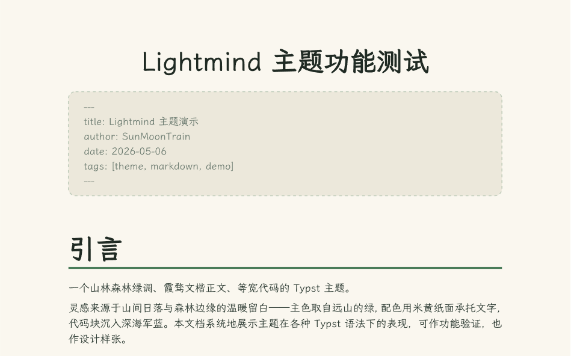


<div align="center">

[English](README.en.md) | **简体中文**

# 🍃 Lightmind 主题模板

> 山林森林绿调的中文文档主题，支持亮色 / 暗色双模式。

[](https://typst.app)
[](https://typst.app/universe/package/fernmind)
[](https://typst.app/universe/package/fernmind)
[](LICENSE)
[](https://github.com/childishtree/lightmind-typst)

</div>

## 📖 目录

- [简介](#简介)
- [特性](#特性)
- [截图](#截图)
- [安装](#安装)
- [使用](#使用)
- [选项](#选项)
- [辅助函数](#辅助函数)
- [目录](#目录)
- [完整效果](#完整效果)
- [静态博客](#静态博客)
- [网页版与 PDF 的差异](#网页版与-pdf-的差异)
- [贡献](#贡献)
- [许可证](#许可证)

## 简介

Lightmind 是一个山林森林绿调的中文文档主题，由同名 Typora 主题改写而来，适合笔记、博客、文档与演示。米黄纸面承托文字、深海军蓝代码块、圆角公式卡片，支持亮色 / 暗色双模式，以及 Markdown 风格排版：YAML 前置元信息、GitHub 风格警告块、任务列表、键位样式等。

*Lightmind is a forest-green Chinese document theme with light and dark modes, adapted from the Typora theme of the same name. It suits notes, blogs, documentation and presentations, and ships with Markdown-style typesetting: YAML front matter, GitHub-style admonitions, task lists, keycaps, rounded code blocks and formula cards.*

## 特性

- 🌲 山林森林绿配色，米黄纸面 + 深海军蓝代码块
- 🌗 亮色 / 暗色双模式（`dark-mode` 参数，网页版可跟随系统）
- 📝 Markdown 风格排版：YAML 前置元信息、警告块、任务列表、键位
- 📐 圆角公式卡片、柔和底色目录、点状引导线
- 🎨 中文伪粗体 / 伪斜体（基于 `@preview/cuti`）
- 🧩 可复用的辅助函数：`frontmatter`、`mark`、`kbd`、`task`、`quote`
- 🖥️ 可选的 HTML 导出，以及把 `.typ` 文章变成静态博客的 `blog/` 脚手架

## 截图

<picture>
  <source media="(prefers-color-scheme: dark)" srcset="lightmind-dark.png">
  
</picture>

## 安装

使用模板初始化一个新项目：

```bash
typst init @preview/fernmind:0.1.0
```

或在已有文档中引入主题：

```typst
#import "@preview/fernmind:0.1.0": lightmind, frontmatter, mark, kbd, task
```

> 需要 Typst 0.13+（推荐 0.15+）。

## 使用

```typst
#show: doc => lightmind(
  title: "我的文档",
  // dark-mode: true,   // 启用暗色主题
  doc,
)

#frontmatter(
  title: "Lightmind 主题演示",
  author: "SunMoonTrain",
  date: "2026-05-06",
  tags: ("theme", "markdown", "demo"),
)
```

## 选项

`lightmind()` 的全部参数：

| 参数 | 说明 | 默认值 |
| --- | --- | --- |
| `title` | 文档标题（居中大标题），`none` 则不显示 | `none` |
| `description` | 文档描述（网页 `<meta>` 与 PDF 元信息） | 主题自带说明 |
| `dark-mode` | 亮暗主题：`true` 暗色 / `false` 亮色 / `"auto"` 跟随系统（PDF 下 `"auto"` 视为亮色） | `"auto"` |
| `font` | 正文字体（回退链） | `("LXGW WenKai", "Source Han Serif SC")` |
| `code-font` | 代码字体（回退链） | `("Cascadia Code", "LXGW WenKai")` |
| `show-code-lang` | 是否显示代码块语言标签 | `true` |
| `allow-page-breaks` | 是否允许分页；`false` 时输出为无限长单页 | `true` |
| `plain-image-alts` | 使用默认图片样式（不套圆角边框）的图片 `alt` 列表 | `()` |
| `equation-numbering` | 行间公式自动编号格式（如 `"(1)"`）；`none` 不编号 | `none` |
| `math-renderer` | 仅网页：公式渲染方式，`"native"`（原生 MathML）或 `"mathjax"` | `"native"` |

## 辅助函数

- `#frontmatter(title: ..., author: ..., date: ..., tags: (...), banner: ("cover.png", 150pt))`：YAML 风格元信息块（支持任意键值对，`banner` 显示顶部横幅）
- `#mark[...]`：高亮文本
- `#kbd[...]`：键位样式
- `#task(checked: true)[...]`：任务列表项
- `#quote(attribution: "note" \| "tip" \| "important" \| "warning" \| "caution")[...]`：GitHub 风格警告块

示例：

```typst
#frontmatter(
  title: "Lightmind 主题演示",
  author: "SunMoonTrain",
  date: "2026-05-06",
  tags: ("theme", "markdown", "demo"),
  banner: ("cover.png", 150pt),
)

#quote(attribution: "tip")[ 主色绿。用于实用建议、最佳实践。 ]

#task(checked: true)[写主题大纲]
#task(checked: false)[跨平台测试]
```

## 目录

在文档中插入目录，例如 `#outline(title: "目录")`。目录以柔和底色卡片 + 左侧绿色色条呈现，一级条目加粗、子级弱化并自动缩进，条目带点状引导线与页码，标题自动套用一级标题样式；暗色模式下自动跟随主题。

## 完整效果

<picture>
  <source media="(prefers-color-scheme: dark)" srcset="test_lightmind_dark.png">
  
</picture>

## 静态博客

仓库内的 `blog/` 是一个把 Typst 文章预渲染成静态博客的脚手架。文章写一遍，构建时同时得到三种阅读方式：

- **网页正文**：Typst 原生 HTML 导出，文字可选中复制，公式是 MathML，目录与脚注是原生锚点，代码块带复制按钮；
- **原版页面**：同一份 `.typ` 导出为逐页 SVG，保留固定纸面版式，支持缩放；
- **PDF / 源文件**：随文章一起提供下载。

它**不复制主题**：构建时把 Typst 的 `--root` 指向仓库根，文章用 `#import "/lightmind.typ"` 直接复用本体的 `lightmind.typ` 与 `web/`，因此主题一改，博客跟着变。外壳用 [animal-island-ui](https://github.com/guokaigdg/animal-island-ui)，配色与字体通过 CSS 变量映射回 Fernmind。

```sh
cd blog
npm install
npm run dev            # 编译文章并启动开发服务器
npm run build          # 构建到 blog/dist/
npm run check          # 校验产物
```

每篇文章在 `content/posts/` 下由同名的 `.typ` 与 `.json` 组成，`json` 提供标题、摘要、分类、日期等元数据。完整说明见 [blog/README.md](blog/README.md)。

## 网页版与 PDF 的差异

网页版与 PDF 共用同一套配色，但**是手工镜像关系，没有自动同步**：

- PDF 侧：`lightmind.typ` 里的 `colors`（亮色）与 `dark-colors`（暗色）两套调色板；
- 网页侧：`web/fernmind.css` 顶部 `:root` 与 `[data-theme="dark"]` 里的 CSS 变量，逐条复制自上面两套。

`fernmind.css` 只在 `target() == "html"` 分支被读取（`lightmind.typ` 在网页分支直接 `return`），**因此改网页样式不会影响 PDF 输出**。反过来也成立。改配色时需要**手动同步两边**。

### 目前有意保留的一处差异：亮色主题下的代码块

| | 亮色代码块 | 暗色代码块 |
| --- | --- | --- |
| PDF | `#1e2330` 深藏青 | `#14181f` |
| 网页 | `#f7f8fa` 浅底 | `#14181f` |

暗色两侧一致；亮色**有意不同**：网页版若沿用深藏青，会与暗色主题的代码块几乎无法区分（这正是最初被反馈的问题），故改为浅底配 One Light 语法色；PDF 沿用深色代码块，是纸质文档的通行做法。

另需注意：**PDF 的语法高亮用的是 Typst 内置默认主题**（`show raw.where(block: true)` 只设置了背景与文字色，未覆盖 `syntax-highlighting`），网页则把它重映射为 One Light / One Dark。所以即使把 PDF 代码块背景也改浅，token 颜色仍不会与网页一致——那需要额外为 PDF 定义一套语法主题。

## 贡献

欢迎提交 Issue 与 Pull Request！

- 🐛 报告问题：<https://github.com/childishtree/lightmind-typst/issues>
- 🚀 提交代码：<https://github.com/childishtree/lightmind-typst/pulls>
- 📦 主题仓库：<https://github.com/childishtree/lightmind-typst>

## 许可证

MIT License，Copyright (c) 2026 Childish_tree。详见 [LICENSE](LICENSE)。
